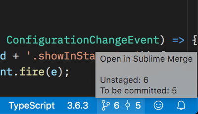

# Sublime Merge for VSCode

Sublime Merge integration for Visual Studio Code

## Features

This extension enables the following commands, available from the
command palette when in a workspace with a Git repository:

- `Open repository in Sublime Merge`: Opens the current workspace in Sublime Merge
- `Blame in Sublime Merge`: Opens the **Blame** view in Sublime Merge
- `File history in Sublime Merge`: Shows the **history** (log) of the current file in Sublime Merge
- `Line history in Sublime Merge`: Shows the history of the **selected line(s)** in Sublime Merge
- `Show my commits in Sublime Merge`: Show commits from the **current Git user** in Sublime Merge

**Note:** Contextual menu items for the editor are also provided and their visibility can be
customised changing the extension settings (see "Configuration").

### Status Bar



The extension shows the number of unstaged / to be committed files in the status bar. 
Clicking on the status bar item will open Sublime Merge.  
It's possible to also show the current branch name
in the status bar item using the `showBranchName` setting.

## Requirements

Make sure that `git` and the `smerge` commands are available within your PATH.

### Setting up the Sublime Merge command line tool

See: https://www.sublimemerge.com/docs/command_line

## Configuration

```js
{
	"vscsm.debug": false, // Enable debug information in the output panel; default: false
	"vscsm.showInStatusBar": false, // Disables the status bar item if false; default: true
	"vscsm.showBranchName": false, // Shows the current branch name in the status bar item; default: false

	// Custom contextual menu items visibility:
	// (see inline help for details)
	"vscsm.showMenu.openInSublimeMerge": false,
	"vscsm.showMenu.fileHistoryInSublimeMerge": "always",
	"vscsm.showMenu.lineHistoryInSublimeMerge": "withSelection",
	"vscsm.showMenu.myCommitsInSublimeMerge": "never",
	"vscsm.showMenu.blameInSublimeMerge": "withSelection",
}
```

## Sublime Merge setup (optional)

The following example (by [Rubén Robles](https://twitter.com/D8vjork/status/1158303356382842881)) shows how it's possible to configure Sublime Merge to use Visual Studio Code as the default editor for opening files:

```json
{
	"editor_path": "/usr/local/bin/code",
	"editor_argument_format": "--goto ${file}:${line}:${col}"
}
```
These can be manually added to the Sublime Merge `Preferences.sublime-settings` file.

## Known Issues / TODO

- The extension hasn't been tested on Windows yet
- Tests are not present

This is my first VSCode extension, therefore any constructive feedback is very welcome.

## Release Notes

See the [Changelog](CHANGELOG.md)

## Special Thanks

I've been able to start working on this extension thanks to the personal development time kindly allowed
by my current employer, [Altmetric](https://www.altmetric.com/jobs/).
